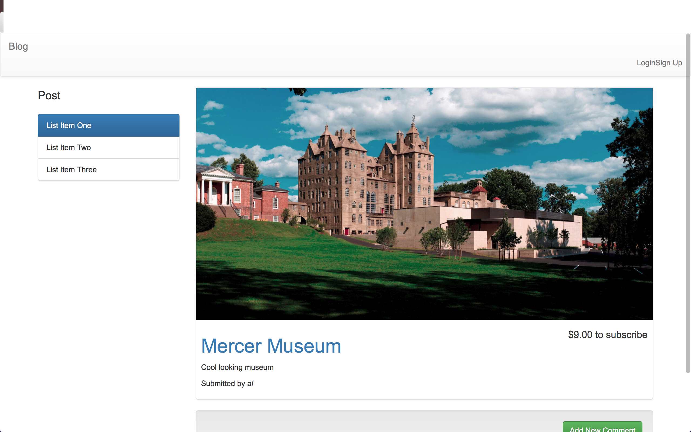

# Node.js Blog Template

Fully functional blog created with web technologies that I learned: MongoDB, Express, Node, and a few npm modules you can find in the package.json file

Includes:
- login/create an account
- posting articles, images, comments, etc.
- backend security using npm module passport

================================================================================

Screenshots:

